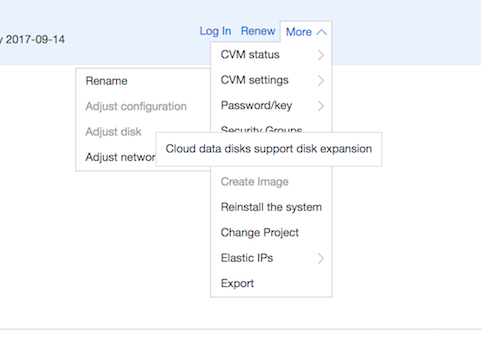
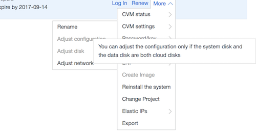

# Docker inside GFW

> * Author: [Damon Yuan](https://www.damonyuan.com)
> * Date: 2017-07-02

Mainland China is a big market and your might want get a piece of cake from it. Normally if you want to apply the Asia-pacific businese to Europe, even if the application logic is exactly the same, it is better to create a new instance in EU zone and change the base url to the new server in order to achieve faster network connection. This also applies to mainland China.

Recently I have an application that require api support inside mainland China and I am using docker. At begining, I think what I need to do is just to find a VPC provider there,  upload the code I deployed in AWS, and run the command `docker-compose up -d`, then everything should be fine in the backend.

But I encountered so many problems during the process and this article provides some experience and hope it will help someone who would do the same task and save some time for the gym.


## 1. The first thing, GFW (Great Fire Wall)

I never heard about it...***[YOU SHOULD READ ABOUT IT THEN](https://en.wikipedia.org/wiki/Great_Firewall).***

> The Great Firewall of China (abbreviated to GFW) is the combination of legislative and technological actions that have been taken by the government of Mainland China (which is controlled by the Communist Party of China, CPC) to regulate the Internet domestically. It is the main instrument used by the government to achieve Internet censorship in China. These CPC regulations include criminalizing certain online speech and activities, blocking from view selected websites, filtering key words out of searches initiated from computers located in Mainland China, requiring international online service provider store their Chinese customer information within China, and slowing down cross-border internet traffic.

The reason is complicated and the fact is not easy to be changed recently, that's why the network connection to access some websites outside the mainland China is slow and some are even not accessible, e.g., www.youtube.com, www.google.com.

Nowadays in software industry, many package management tool is developed to make developers' life easier. We can see Homebrew for Mac, Apt-get for Ubuntu, NPM for javascript, gem for ruby, etc. Because of the GFW, all connections to the server outside mainland China is relatively slow, which makes it hard for developers to fetch the packages, tools, libs from remote. An incidence happened in September 2015, [XcodeGhost](https://en.wikipedia.org/wiki/XcodeGhost), is actually caused by the slow network speed in mainland china and the developers there looked for local copies for Apple Xcode development environment, and encountered altered versions that had been posted on domestic web sites.

When using docker, normally only the code write by ourselves will be added into the image through Dockerfile.  Libraries used by the application are usually fetched directly through package manager.  Here is a example of Dockerfile:

```
  FROM ruby:2.3

  RUN apt-get update \
    && apt-get install -y --no-install-recommends \
    postgresql-client \
    && rm -rf /var/lib/apt/lists/*

  WORKDIR /usr/src/app
  COPY Gemfile* ./
  RUN bundle install
  COPY . .

  EXPOSE 3000
  CMD ["rails", "server", "-b", "0.0.0.0"]
```

The linux package is installed through `apt-get`, and the gems used by the application is installed through `bundle install`.

## 2. The second thing, ICP (Internet Content Provider) license

You still need to read a little more if you do not want your connection being blocked mysteriously all of a sudden. Information about ***[MAINLAND CHINA ICP](https://en.wikipedia.org/wiki/ICP_license)***.

Genaral speaking, all websites with their own domain name that operate inside mainland China are required to obtain a licence, and China-based Internet service providers are required to block the site if a licence is not acquired within a grace period.

If your backend is just API server and do not need a domain for the website, then the regulation might be circumvented by using ip address and port directly. But this approach has not been confirmed. Some of the VPC provider might help to apply for an ICP license with some files uploaded. As I know, qcloud from Tencent is one of them.</p></li>

## 3. The last thing, VPC providers.

here I have picked some of the best choices:

* [qcloud](https://www.qcloud.com/) from Tencent
* [aliyun](https://intl.aliyun.com/) from Alibaba
* [AWS](https://www.amazonaws.cn/en/) from AWS China

Here I selected Tecent because they can help me on the ICP license. As I have metioned before, I just upload all my source code there and run `docker-compose up -d`, hope things setup magically.

But...


There are so many problem during the shipment. Here are the pitfalls that I have get myself in and I hope you guys do not get the shit hit the fan again... I was using qcloud from Tencent and here are the detailed steps I had gone through.

----

## 1. Choose the right configuration for the host machine.

I got myself used to aws and normally I will setup a small instance to do some test until I feel good enough and then adjust its configuration to the scale I need. So I choose the most basic configuration on qcloud as well: Series 1, 1 core-cpu, 1G memory, 1Mbps network, local hard disk for system. However some of the configuration cannot be upgraded after selected, and there is no obvious instruction on that(at least I didn't see it).

The first problem I encounter is ***1G memory is not enough to run `docker-compose up -d`***, in the command line it syas:

`fatal error: runtime: out of memory`

***Remember to set at least 2G memory for your instance if you want to run docker inside it.***

At first, I think it is fine because I thought I can adjust the configuration and upgrade the machine.

But...



Sorry, ***you cannot change the configuration after you choose local disk and you cannot adjust disk size and you cannot change the disk type from local to cloud, and I have paied the machine for the next half year because it is cheaper if not based on usage but on contract.***

To sum it up, take care to do the configuration before you set it up, for docker to build smoothly inside the machine, at least 2GB memory should be allocated, and choose the cloud disk rather than local disk other than you have justified reasons. ***And the experience is based on qclound, as to aliyum and aws China, please google more and if you got some experience on them, please share with others.***

----

## 2. Installing the docker in the right way

Because the network connecting to other parts of the world in mainland China is slow, different VPC providers have provided accelerate script to help fetching the dockers images. 

Here is the [link](https://www.qcloud.com/document/product/457/7207 "link") for how to do it in qcloud. What a pity that they didn't provide a script for automatically installation yet, so I use aliyum's script here.

`curl -sSL http://acs-public-mirror.oss-cn-hangzhou.aliyuncs.com/docker-engine/internet | sh -`

It is better to add default user into docker group to prevent input `sudo` everytime.

`sudo usermod -aG docker ubuntu`

After all these done, the image fetching process will be much faster, and you can build you image with VPN in your local machine if you are inside mainland China network, and push it to docker-hub registry, and fetch it afterward.

----

## 3. Do not build the image inside the host

Officially docker image should be built and push to registry before usage, but some guys still prefer to build it after all the source code pushed to the VPC. If the virtual machine has good access to the network it is fine under most cases, but if the network is inside the mainland China, you will find that the terminal always hang up there when you are fetch some libraries from remote. I had experienced that when the `bundle install` tries to fetch gems. I interrupted the process many time and tried to do it again, but still failed. Finally, my solution is to build it in my local machine and push it to docker-hub. 

There are more than one way that can help prevent this problem:

#### 1. Docker registry

you can use docker-hub or event create your own registry, build it in a machine that has good internet access, and push the image to the registry. 

#### 2. ShadowSocks (or GoAgent)

[ShadowSocks](https://shadowsocks.org/en/index.html "ShadowSocks") is a good thing for developers in mainland China. To use it, you have to rent a machine outside mainland China. I initiated an instance in AWS singapore zone and install the tool using the command: 
    
```$ pip install shadowsocks```

Because shadowsocks need to create a .pid file in `/var/run` folder which is owned by root, it needs to be installed in root.

```
$ sudo -i
$ python --version
Python 2.6.8
$ pip install shadowsocks
$ vi /etc/shadowsocks.json
{
"server":"0.0.0.0", // many tutorial tell you to input the real ip of your vm, but actually you should put "0.0.0.0" here. Reason??? However in client side you need to fill the relastic ip into the proxy server configuration.
"server_port":8388, // the remote port, you will fill it in client proxy server configuration
"local_address":"127.0.0.1", // the local ip
"local_port":1080,  // the local port
"password":"xxxx", // password
"timeout":300, // timeout
"method":"rc4-md5", // encryption method
"fast_open": false， // https://github.com/shadowsocks/shadowsocks/wiki/TCP-Fast-Open and https://en.wikipedia.org/wiki/TCP_Fast_Open
"workers": 2
}
$ ssserver -c /etc/shadowsocks.json -d start // start server in detach mode
$ echo 'sudo ssserver -c /etc/shadowsocks.json -d start' >> /etc/rc.d/rc.local // start the ss server when system reboot
$ exit
```

And in client side (the virtual machine inside mainland China), client configuration is as follows:

```
$ sudo -i
$ python --version
Python 2.6.8
$ pip install shadowsocks
$ vi /etc/shadowsocks.json
{
"server":"xxxx", // here is the relastic ip of your server
"server_port":8388, // the remote port, you will fill it in client proxy server configuration
"local_address":"127.0.0.1", // the local ip
"local_port":1080,  // the local port
"password":"xxxx", // password
"timeout":300, // timeout
"method":"rc4-md5", // encryption method
}
$ exit
```

check if the client work

```
$ sudo systemctl status rc-local.service
```

then during docker build,  you can start the client by

```
$ sudo sslocal -c /etc/shadowsocks.json -d start
```

It enable the proxy globally and after docker build is done, you can turn the proxy off by: 

```
$ sudo sslocal -c /etc/shadowsocks.json -d stop
```

#### 3. VPN
    
You can setup some VPN in the machine you are going to deploy to. I have not tried this method yet but I think it should have the same effects as the ShadowSocks.

Do not use orginal OpenVPN!! The GFW can distinguish the packet of OpenVPN and once found your ip address will be blocked immediately. There are some mutated version can be used, e.g., SoftEther VPN.

The main difference between ShadowSocks and VPN is that only the TCP/UDP traffic is going through the tunnel of the two virtual machines in ShadowSocks, while for VPN all the traffic will go throught your service provider.

----

## 4. Better to do

Until now the docker application should have been setup and run as expected, but there are two more tips that worth some attention:

1. Add swapfile for the system
2. Using nginx as proxy so that the machine can host more than one docker application and set the upload file limite, etc.

----

Hope this article can save some time for those who wanna deploy the application with docker in mainland China network.
