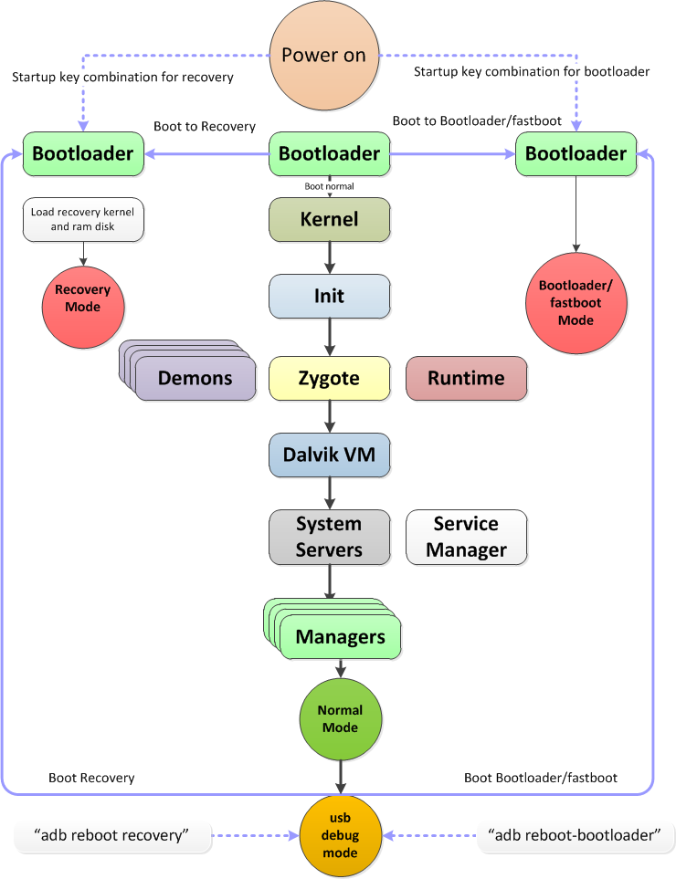

# Android Booting Process

> * Reference: [Android bootloader/fastboot mode and recovery mode explained/Android boot process](https://tektab.com/2015/10/31/android-bootloaderfastboot-mode-and-recovery-mode-explained/)
> * Reference: [Booting Android](http://2net.co.uk/slides/android-boot-slides-2.0.pdf)

**One Image Per Day**

To add to what [Android bootloader/fastboot mode and recovery mode explained/Android boot process](https://tektab.com/2015/10/31/android-bootloaderfastboot-mode-and-recovery-mode-explained/) has provided, I want to give some more details from Bootloader of normal boot to Kernel.

  1. Bootloader of normal boot / PBL (primary bootloader)
  
     The program is saved inside and run by the CPU and provided by the CPU manufacturer. It cannot be customized by a developer.
     
  2. SBL (Secondary Bootloader)
    
     Normally it is provided by the device manufacture / OEM. While Primary boot loader doesn't mean the first stage of a boot loader, and secondary boot loader doesn't mean the second stage of a boot loader.
     
     > [primary and secondary boot loaders](https://superuser.com/questions/707050/primary-and-secondary-boot-loaders)
     
  3. RPM (Resource & Power Manager)      
  
     Normally it is provided by the device manufacture / OEM.
     
  4. TZ (Trust Zone)
  
     > [Hardware-backed Keystore](https://source.android.com/security/keystore)   
     > [Trusty](https://source.android.com/security/trusty)
     
  5. LK (Little Kernel)
  
     * init hardware module
     * update cmdline and distinguish the startup mode
     * select and update device tree
     * setup system status and prepare to init the Kernel
     * fastboot
     * authorization
     
  6. Kernel        
      
