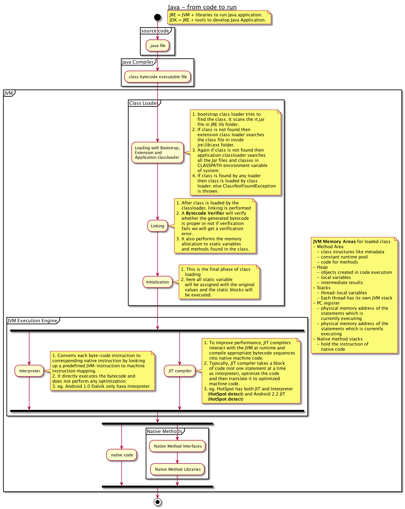
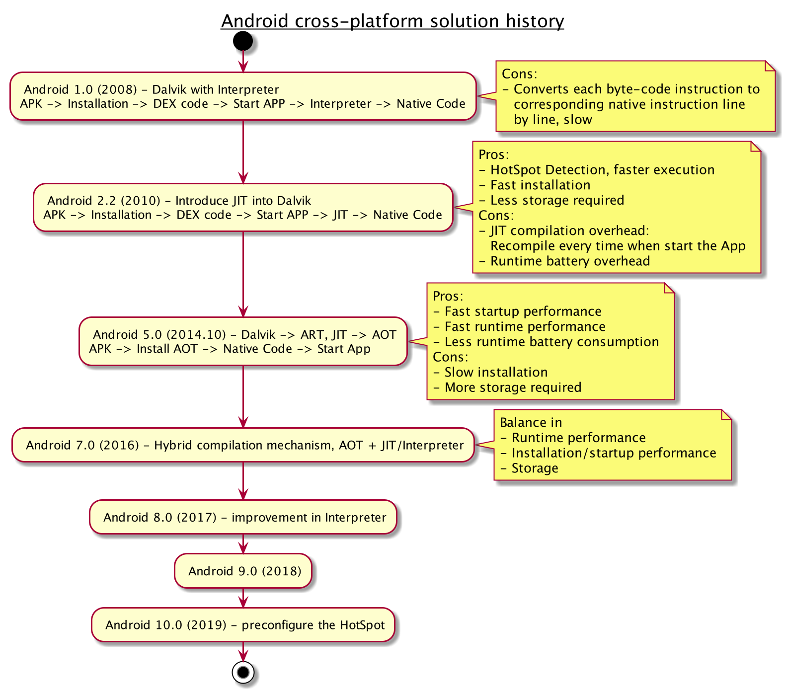

# Java - from code to run

> * Author: [Damon Yuan](https://www.damonyuan.com)
> * Date: 2019-11-30
> * Reference: 
> * [What is Java JDK, JRE and JVM – In-depth Analysis](https://howtodoinjava.com/java/basics/jdk-jre-jvm/)
> * [Bytecode](https://en.wikipedia.org/wiki/Bytecode)
> * [The Programming Process](http://www2.hawaii.edu/~takebaya/ics111/process_of_programming/process_of_programming.html)
> * [漫话：如何给女朋友解释鸿蒙OS是怎样实现跨平台的？](https://juejin.im/post/5d50d05ee51d4561da620117)

**One Image Per Day**

P.S., the history of Android cross-platform solution,

- languages do prepared-beforehand compiling from source code to machine code (and then link with other existing compiled object files), a.k.a., compiled languages: C, C++ (might have Assembly code as the intermediary language)
- languages compile to bytecode and then passing the bytecode to virtual machine; in the vm the bytecode will be interpreted to machine code through JIT interpreter, a.k.a., VM programming languages: Java, Python, PHP ...
- languages work by walking an AST representation derived from the source code, a.k.a., interpreted programming languages: Perl, Ruby 1.8 ...
- languages do directly JIT compiling from source code to machine code with no bytecode intermediary: JavaScript V8, Dart ...