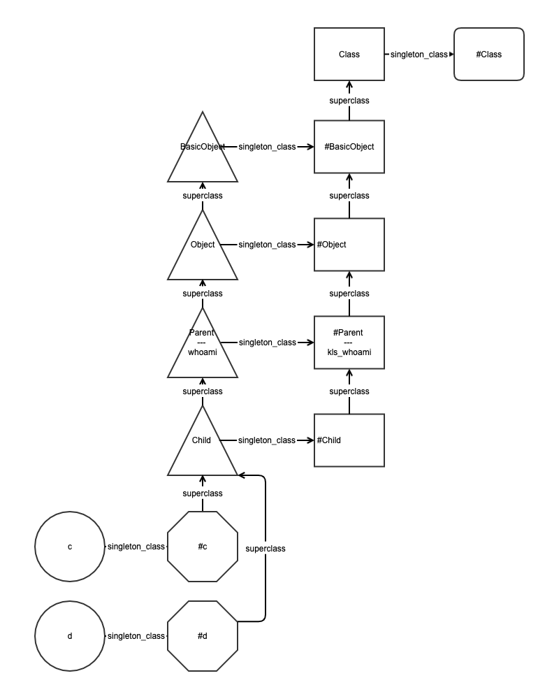
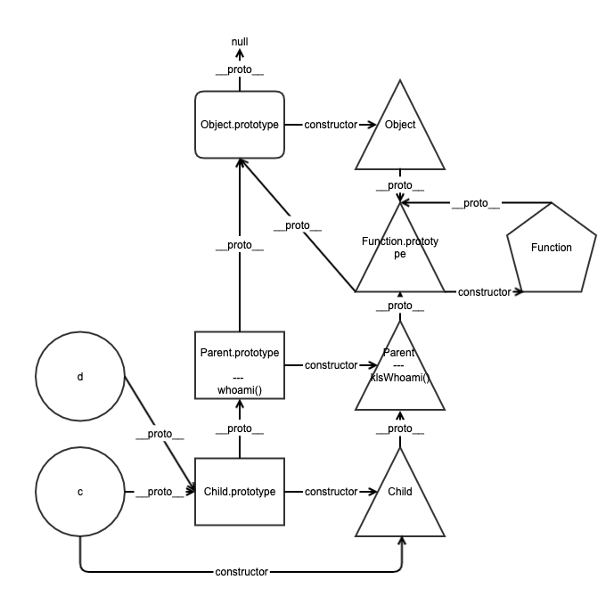
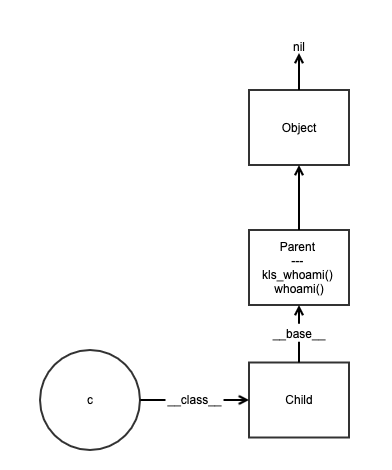

# Call a Class Method from an Instance in Python

> * Author: [Damon Yuan](https://www.damonyuan.com)
> * Date: 2020-02-24

I'm brushing up my Python skills recently and trying to figure out the inheritance chain in Python. However to my surprise, I accidently found that the class method can be invoked from a instance,

```
#!/usr/bin/env python

class Parent:
    @classmethod
    def kls_whoami(cls):
        print('class')
    def whoami(self):
        print('instance')     

class Child(Parent):
    def __init__(self):
        print('init')
     

c = Child()
c.whoami() # instance
Child.kls_whoami() # class
c.kls_whoami() # class -> ? why
```

I was shocked because it never happens in JavaScript, Ruby or other languages that I know, and it seems to have broken the principle of encapsulation - how come a class method can be called from an object, why is it so special and and what's the differences between Python and other languages' inheritance models?

As the questions haunting around my mind, I decided to dig into it.

## Why Ruby and JavaScript do not have this problem

One of the efficient study pattern is learning through comparison. I picked Ruby and JavaScript for this purpose in this case.

### Ruby

First of all let's check the Ruby's inheritance model. 

My test is based on 

Tested in `irb`,
```
#!/usr/bin/ruby -w
class Parent
  def self.kls_whoami
    puts 'class'
  end

  def whoami
    puts 'instance'
  end
end

class Child < Parent
end

c = Child.new
d = Child.new
c.whoami # instance
Child.kls_whoami # class
c.kls_whoami # undefined method
```

and the inheritance model is

  

When `c.whoami` is invoked, the search chain is 

   1. check if object `c`'s singleton_class `#c` has the `whoami` method 
   2. if it's not there, it goes up to the ancestor chain - `Child` class
   3. if not found in `Child`, it would check the `Parent` class. Here we find the instance method `whoami`
   4. `NoMethodError` would be throw if there're no method with this signature found

When `Child.kls_whoami` is invoked, the search chain is    

   1. check if the `Child` class's singleton_class `#Child` contains the `kls_whoami`
   2. if not, climb up to its superclass, `#Parent`. Here we find the class method `kls_whoami`

Through the analysis we know the instance methods and class methods live in different namespaces - the singleton_class of the object / the class and the singleton class of the class. And isolation ensures no static methods will be touch when called on an instance of that class.

### JavaScript

We will do the similar analysis on JavaScript, which is famous for the prototype pattern in inheritance model,

```
#!/usr/bin/env node
class Parent {
    static klsWhoami() {
        console.log('class')
    }    

    whoami() { 
        console.log('instance')
    }    
}

class Child extends Parent {
}

let c = new Child();
c.whoami(); # instance
Child.klsWhoami(); # class
c.klsWhoami(); # TypeError: c.klsWhoami is not a function
```

and the inheritance model is

  

When `c.whoami()` is invoked, the search chain is 

   1. check if `Child.prototype` contains the instance method
   2. if not, climb up to the `Parent.prototype`. Here we find the `whoami()` instance method

When `Child.klsWhoami()` is invoked, the search chain is      

   1. check if `Child` function / constructor contains the class method
   2. if not, check its ancestor `Parent` to see if it's there. Here we find the `klsWhoami` class method

Similarly we know now in JavaScript, instance methods and class methods exist in different namespace, so that when call the `klsWhoami()` method on `c` object, `TypeError: c.klsWhoami is not a function` will be throw.

## How is Python's inheritance model

In Python, Class and instance methods live in the same namespace, it also enforces that the signature of instance methods and class/static methods cannot be the same.

The magic that transforms your obj.method(*args) call into method(obj, *args) is inside a .__get__() implementation of the function object that is, in fact, a non-data descriptor.

This works for regular instance methods just like it does for class methods or static methods. So, if you call a static method with obj.method(*args), then it’s automatically transformed into method(*args). Similarly, if you call a class method with obj.method(type(obj), *args), then it’s automatically transformed into method(type(obj), *args).

Reference: ([Python Descriptors: An Introduction](https://realpython.com/python-descriptors/))



Much simpler, right?

When `c.whoami()` is invoked, the search chain will

   1. check if the instance's namespace contains the method. Here we find the bound method and using the descriptor to access the method, the descriptor will help to call the method using `Parent.whoami(c)`
   2. Otherwise, check if the type of the instance and see if the type's namespace contains the method
   3. if still not found, escalate through the chain until it reach the end

When `c.kls_whoami()` is called, the search chain will

   1. check if the instance's namespace contains the method. Here we find the bound method and using the descriptor to access the method, the descriptor will help to call the method using `Parent.kls_whoami(type(c))`
   2. Otherwise, check if the type of the instance and see if the type's namespace contains the method
   3. if still not found, escalate through the chain until it reach the end

`Child.kls_whoami()` and `Parent.kls_whoami()` is similar except that they are starting from the namespace of `Child` class and `Parent` class respectively.

Both the class method and the instance method live in the `Parant` class's namespace, and the built-in non-data descriptor will help the instance to find the bound methods and convert the instance called upon to the arguments required by the method. For these reasons, a class method can be called on a python object instance without throwing any exceptions.


