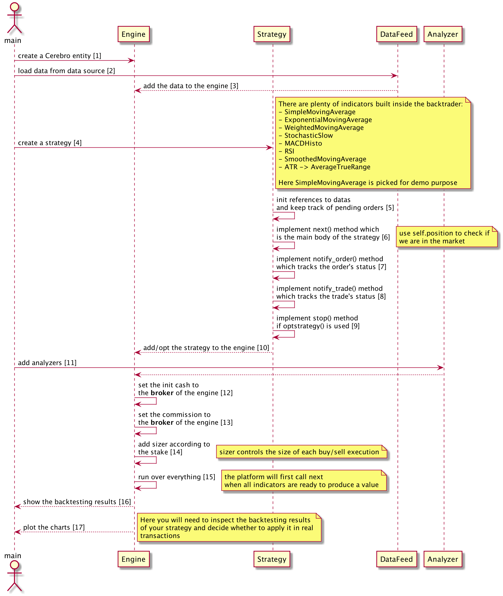

# backtrader 基本架构

> * Author: [Damon Yuan](https://www.damonyuan.com)
> * Date: 2020-09-09
> * 微信公众号: [backtrader 基本架构](https://mp.weixin.qq.com/s/8Jt2TN1Ndozg4MXFP8izHQ)

作为一个初学者，剖析一下本工具的基本架构，明白大家都很懒不想看代码，所以制作了一张流程图，希望对大家理解有所帮助。


直接上码，

Code:

```
from __future__ import (absolute_import, division, print_function,
                        unicode_literals)
import backtrader as bt
import backtrader.feeds as btfeeds
import pandas as pd
import matplotlib.pyplot as plt
import tushare as ts
ts.set_token('YOUR TOKEN')
pro = ts.pro_api('YOUR TOKEN')


class SmaStrategy(bt.Strategy):  # [4]
    params = (('maperiod', 20), ('printlog', True))

    def __init__(self):
        self.dataclose = self.datas[0].close  # [5]
        self.order = None
        self.buyprice = None
        self.buycomm = None
        self.sma = bt.indicators.SimpleMovingAverage(self.datas[0], period=self.params.maperiod)

    def notify_order(self, order):  # [7]
        if order.status in [order.Submitted, order.Accepted]:
            # Buy/Sell order submitted/accepted to/by broker - 现在不重要
            return
        # 检查一个 order 有没有完成
        # 注意： broker 可以 reject order 如果没有足够的 cash
        if order.status in [order.Completed]:
            if order.isbuy(): # 买
                self.log(
                    'BUY EXECUTED, Price: %.2f, Cost: %.2f, Comm %.2f' %
                    (order.executed.price,
                     order.executed.value,
                     order.executed.comm))
                self.buyprice = order.executed.price
                self.buycomm = order.executed.comm
            else:  # 卖
                self.log('SELL EXECUTED, Price: %.2f, Cost: %.2f, Comm %.2f' %
                         (order.executed.price,
                          order.executed.value,
                          order.executed.comm))
            self.bar_executed = len(self)
        elif order.status in [order.Canceled, order.Margin, order.Rejected]:
            self.log('Order Canceled/Margin/Rejected')

        # Write down: no pending order
        self.order = None

    def notify_trade(self, trade):  # [8]
        if not trade.isclosed:
            return
        self.log('OPERATION PROFIT, GROSS %.2f, NET %.2f' %
                 (trade.pnl, trade.pnlcomm))

    def log(self, txt, dt=None, doprint=False):
        if self.params.printlog or doprint:
            dt = dt or self.datas[0].datetime.date(0)
            print('%s, %s' % (dt.isoformat(), txt))

    def next(self):  # [6]
        if self.order:
            return
        if not self.position:
            if self.dataclose[0] > self.sma[0]:
                self.log('buy - close %.2f' % self.dataclose[0])
                self.order = self.buy()
            else:
                if self.dataclose[0] < self.sma[0]:
                    self.order = self.sell()

    def stop(self):  # [9]
        self.log('(MA Period %2d) Ending Value %.2f' %
                 (self.params.maperiod, self.broker.getvalue()), doprint=True)


class TushareDataFeed:
    def __init__(self, code, start, end):
        self.code = code
        self.start = start
        self.end = end

    def get_data(self):
        df = ts.pro_bar(ts_code=self.code, adj='qfq', start_date=self.start, end_date=self.end)
        df['date'] = df['trade_date']
        df['volume'] = df['vol']
        df.index = pd.to_datetime(df['date'])
        df['openinterest'] = 0
        df = df[['open', 'high', 'low', 'close', 'volume', 'openinterest']]
        return btfeeds.PandasData(dataname=df.sort_index(), fromdate=pd.to_datetime(self.start), todate=pd.to_datetime(self.end))


if __name__ == '__main__':
    cerebro = bt.Cerebro()  # [1]

    data = TushareDataFeed(code='600000.SH', start='20100331', end='20200331').get_data()  # [2]
    cerebro.adddata(data)  # [3]

    cerebro.addstrategy(SmaStrategy)  # [10]
    # strats = cerebro.optstrategy(KnnStrategy, maperiod=range(10, 11))  # [10]

    cerebro.addanalyzer(bt.analyzers.SharpeRatio, _name='SharpeRatio')  # [11]
    cerebro.addanalyzer(bt.analyzers.DrawDown, _name='DW')  # [11]

    cerebro.broker.setcash(10000)  # [12]
    cerebro.broker.setcommission(commission=0.002)  # [13]
    cerebro.addsizer(bt.sizers.FixedSize, stake=500)  # [14]

    results = cerebro.run(maxcpus=1)  # [15]
    strat = results[0]  # [16]

    print('夏普比率:', strat.analyzers.SharpeRatio.get_analysis())
    print('回撤指标:', strat.analyzers.DW.get_analysis())

    plt.rcParams['font.sans-serif'] = ['SimHei']
    plt.rcParams['axes.unicode_minus'] = False
    plt.rcParams['figure.figsize'] = [9, 8]
    plt.rcParams['figure.dpi'] = 125
    plt.rcParams['figure.facecolor'] = 'w'
    plt.rcParams['figure.edgecolor'] = 'k'
    cerebro.plot(iplot=False)  # [17]
```

代码一大堆，码上上图，

